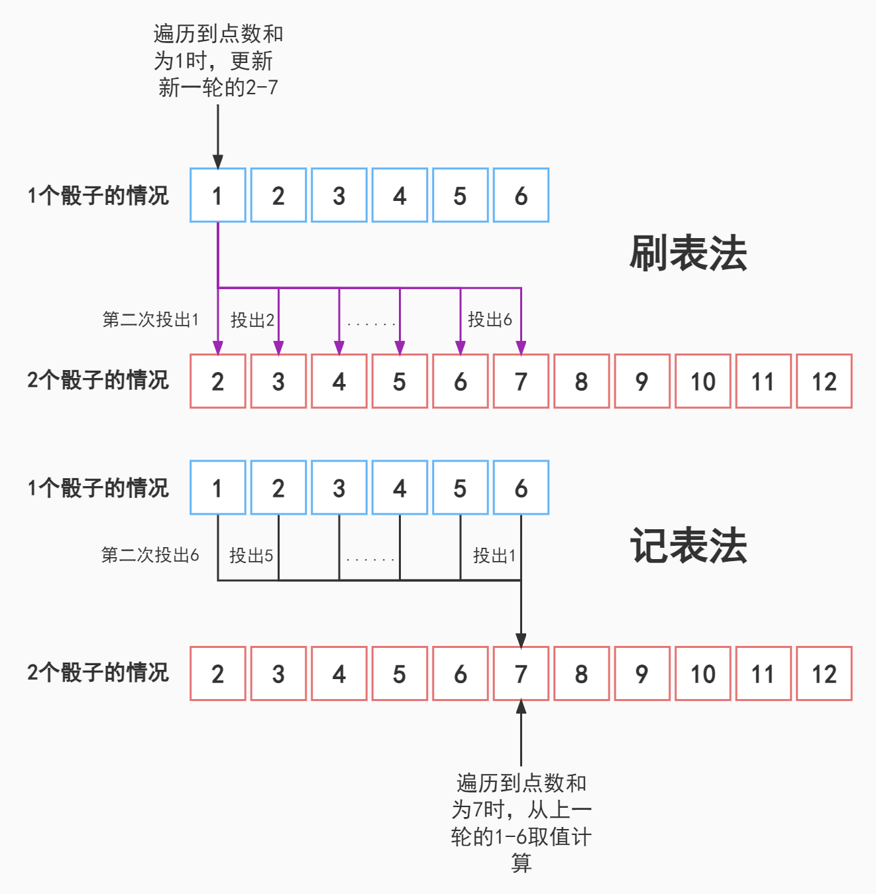

# 算法题单

# 单调栈

基本特征是：求某个元素附近最大/最小的元素，问题也会和左右元素形成的区间有关。

个人总结：

题目常以一个数组做输入，通常需要遍历数组进行某种与附近（这个附近定义通常与局部的单调性有关）元素相关的操作，且只要复杂度超过`O(nlogn)`就会超时，所以不得不在遍历过程中记录关键数据（通常是区间上的最值），此时O(1)的空间复杂度常常难以完成。

| 题目链接                                                     | 特点                                          |
| ------------------------------------------------------------ | --------------------------------------------- |
| [剑指 Offer 30. 包含min函数的栈](https://leetcode.cn/problems/bao-han-minhan-shu-de-zhan-lcof/) | 经典单调栈                                    |
| [739.每日温度](https://leetcode.cn/problems/daily-temperatures/) | 存下标是一种很常见的做法。                    |
| [901. 股票价格跨度](https://leetcode.cn/problems/online-stock-span/) | 同上                                          |
| [496. 下一个更大元素 I](https://leetcode.cn/problems/next-greater-element-i/) | 打破单调栈题目中只有一个数组的思维惯性。      |
| [503. 下一个更大元素 II](https://leetcode.cn/problems/next-greater-element-ii/) | 需要额外解决循环数组的问题。                  |
| [239. 滑动窗口最大值](https://leetcode.cn/problems/sliding-window-maximum/) | 使用双端队列维护单调性，是最小/大栈的进阶题目 |
| [剑指 Offer 59 - II. 队列的最大值](https://leetcode.cn/problems/dui-lie-de-zui-da-zhi-lcof/) | 同上                                          |
| [581. 最短无序连续子数组](https://leetcode-cn.com/problems/shortest-unsorted-continuous-subarray/) | 利用出栈的意义解题，出栈即意味着不满足单调性  |
| [剑指 Offer 33. 二叉搜索树的后序遍历序列](https://leetcode.cn/problems/er-cha-sou-suo-shu-de-hou-xu-bian-li-xu-lie-lcof/) | 利用出栈操作                                  |
| [42. 接雨水](https://leetcode.cn/problems/trapping-rain-water/) | 利用出栈操作+区间计算                         |
| [84. 柱状图中最大的矩形](https://leetcode.cn/problems/largest-rectangle-in-histogram/) | 区间计算                                      |

建议顺序：739, 901 => 496、503、 239、剑指II 59 => 剑指 33 、581 => 84 => 42

## 题目

### 一、 下一个更大元素

**基础模板**：

```java
 public int[] nextGreaterNum(int[] nums) {
        Deque<Integer> stack = new LinkedList<>();
        int n = nums.length;
        int[] ans = new int[n];
        for(int i=n-1; i>=0; i--){
            while(!stack.isEmpty() && stack.peek() <= nums[i]){
                stack.pop();
            }
            // 此时栈为空代表没有更大元素
            ans[i] = stack.isEmpty() ? -1 : stack.peek();
            stack.push(nums[i]);
        }
        return ans;
    }
```

- [739.每日温度](https://leetcode.cn/problems/daily-temperatures/)
- [901. 股票价格跨度](https://leetcode.cn/problems/online-stock-span/)

单调栈的第一个变式，在栈中保存下标而不是元素本身，这种变化在题目中很常见，需要优先熟悉。

签名介绍的单调栈模板更加符合直觉，即栈中的元素是符合单调性的。但是题目常常用到下标来计算，所以很多情况下在辅助栈中直接存储下标，这是单调栈实践的第一个坎。很多题目还需要配合哨兵节点来解决一些特殊用例，如[581. 最短无序连续子数组](https://leetcode-cn.com/problems/shortest-unsorted-continuous-subarray/)。

### 二、一个栈 + 一个数组

- [496. 下一个更大元素 I](https://leetcode.cn/problems/next-greater-element-i/)
- [503. 下一个更大元素 II](https://leetcode.cn/problems/next-greater-element-ii/)
- [239. 滑动窗口最大值](https://leetcode.cn/problems/sliding-window-maximum/)

单调栈通常只对一个数组进行操作，模板较为简单。在练习单调栈题目时，不小心就把模板背熟了，但可能对单调栈的理解还差很远。读者可以尝试做这两道题，看看自己理解是否透彻。

前两道题只是数组形式上的变化，本质上还是对一个数组的操作。

第三题使用双端队列维护单调性，其变化在于滑动窗口，是最小栈/最大栈问题的进阶版，值得一练。

### 三、利用出栈操作

单调性常常作为题目的题眼所在，单调栈在这类题目上有很大的作用。

因为栈中的元素是符合单调性，而被出栈的元素自然是打破了单调性的元素，这在题目背景中常常有特殊意义。

比如：

[581. 最短无序连续子数组](https://leetcode-cn.com/problems/shortest-unsorted-continuous-subarray/)：如果序列递增被打破，说明当前元素属于乱序部分。

[42. 接雨水](https://leetcode.cn/problems/trapping-rain-water/)：如果序列递减被打破，代表需要开始计算积水量了。[相关题解](https://leetcode.cn/problems/trapping-rain-water/solution/trapping-rain-water-by-ikaruga/)

[剑指 Offer 33. 二叉搜索树的后序遍历序列](https://leetcode.cn/problems/er-cha-sou-suo-shu-de-hou-xu-bian-li-xu-lie-lcof/)：这一题反映了二叉搜索树的后序遍历规律，即一个后续遍历序列的根节点一定在在节点右边，而在二叉搜索树中，这代表第一个比某数大数在该数右边。[相关题解](https://leetcode.cn/problems/er-cha-sou-suo-shu-de-hou-xu-bian-li-xu-lie-lcof/solution/mian-shi-ti-33-er-cha-sou-suo-shu-de-hou-xu-bian-6/)

**区间最值问题**:

单调性和最值相关不是理所应当吗？尤其是极大值和极小值。这一类问题，在入栈出栈的过程中，维护栈中的元素为附近的极值。至于附近是哪个附近不需要担心，当然是上一个极值到当前位置啦。因为遍历顺序一般都给了，不然区间最值问题就得用线段树了。

基础题：[剑指 Offer 30. 包含min函数的栈](https://leetcode.cn/problems/bao-han-minhan-shu-de-zhan-lcof/)，面试典中典，此题特殊在，不需要出栈操作。

进阶题目：[剑指 Offer 59 - II. 队列的最大值](https://leetcode.cn/problems/dui-lie-de-zui-da-zhi-lcof/)，[239. 滑动窗口最大值](https://leetcode.cn/problems/sliding-window-maximum/)，出栈保证栈中存储的是附近的最大值，整个区间的最大值要从队头取。

具体应用方法肯定变化多样，但是单调栈在其中都起到了两种作用：

1. 存储值，用以检测单调性，这是O(1)的空间复杂度很难做到的。
2. 弹出值，用以计算核心问题

**理解了以上两点后，就可以挑战最后的区间问题了。**

### 四、区间问题

- [42. 接雨水](https://leetcode.cn/problems/trapping-rain-water/)
- [84. 柱状图中最大的矩形](https://leetcode.cn/problems/largest-rectangle-in-histogram/)

这种题目将上面的1、3结合起来，问题一般是对每个元素的枚举才能得到，例如42题，求总积水量，84题求最值。

而想要枚举出的子问题，必须根据附近的区间来决定，例如42题，一个先递减到递增才会存水，84题（根据高度枚举）要将左右不低于当前值的值计算进来。

### 五、总结

单调栈题目的主要特点是一个具有单调性的栈（这是废话），用法多种多样。如上文所述，不是基础的”下一个最大值“引申出来的区间相关问题，就是与维护栈的过程有关，可能拿出栈做文章，也可能是用栈维护最值等等。关键词：遍历数组、动态区间、空间换时间、单调性、最值。

# 动态规划的刷表法和记表法

> 我大抵是病了，面前的两道题都写不出来，一道是动规题，另一道还是动规题。

百题水平的选手，识别动规并不是什么难事，但是能看出来和能写出来还是差了很远的距离。这篇文章将带大家填平这中间的部分沟壑。


本次要介绍的是动态规划的一种解题技巧，刷表法和记表法。

刷表法和记表法**所解决主要问题**：状态转移方程中**新状态是若干个老状态的映射**，加和可，取最值亦可，但应满足结合律。可以帮助我们在知道转移方程后，快速写出没有bug代码。

以 [剑指 Offer 60. n个骰子的点数](https://leetcode.cn/problems/nge-tou-zi-de-dian-shu-lcof/) 为例，题目要求n个骰子组成点数和的概率情况：

假设 n - 1个骰子点数和为x的解为 `f(n-1, x)`，则点数符合的转移公式为：
$$
f(n, x) = \sum_{i=1}^{6}{f(n-1, x-i)} \times \frac{1}{6}
$$
翻译成中文，就是`n`个骰子点数和为`x`的概率，是`n-1`个骰子点数和为`x-6 `到`x-1` 的概率和乘 `1/6`。

每一个新的结果，一次计算便由上一轮的若干结果求得，是通过记录的前置值算新值，俗称记表法。

根据这种思想，可能会写出下面的代码：

```java
public double[] dicesProbability(int n) {
        double p = 1/6.0;
        double[] ans = new double[]{p, p, p, p, p, p};

        for(int i=2; i<=n; i++){
            int len = ans.length + 5;
            double[] temp = new double[len];
            for(int j=0; j<len; j++){
                // 骰子数为n，点数和为x的概率是骰子数位n-1的时候，与x相差1~6的情况概率的和。
                for(int l = Math.max(0, j-5); l<=j && l < ans.length; l++){
                        temp[j] += ans[l];
                    }
                temp[j]/=6;
            }
            ans = temp;
        }

        return ans;
    }
```

但说实话，这种情况虽然直观，但是却不太好写。

```java
for(int l = Math.max(0, j-5); l<=j && l < ans.length; l++)
```

上面循环中的`l`既要满足`l`指向的点数与`x`相差`1~6`，又要保证合法，不溢出。思维难度就比较大了，比较容易出错。

而这道题如果使用刷表法，

```java
public double[] dicesProbability(int n) {
        double p = 1/6.0;
        double[] arr = new double[]{p, p, p, p, p, p};

        for(int i=1; i<n; i++){
            double[] temp = new double[arr.length + 5];
            for(int j=0; j<arr.length; j++){
                // 解前置状态即n-1个骰子点数和为x处，分别更新n个骰子x+1到x+6的状态
                for(int k=0; k<6; k++){
                    temp[j+k] += arr[j] * p;
                }
            }
            arr = temp;
        }

        return arr;
    }
```

由于`f(n, x)` （第n轮）通常是若干个`f(n-1)`（第n轮的值）的函数，我们可以在遍历到前置状态的某个值时，将变化累积到目标上。

刷表和记表的区别可以用一张图来概括：



以下给出题目列表，一般来说，每道题都可以用两种方法解决，但每道题都偏向于使用某种解法。

## 题目列表

| 题目连接                                                     | 偏向解法 |
| ------------------------------------------------------------ | -------- |
| [剑指 Offer 60. n个骰子的点数](https://leetcode.cn/problems/nge-tou-zi-de-dian-shu-lcof/) | 刷表法   |

更新中...